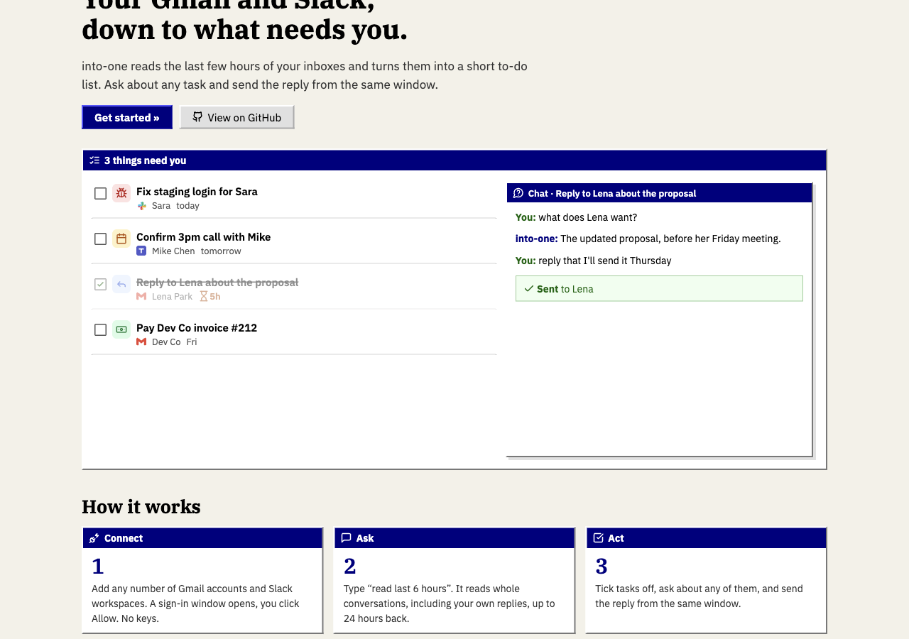

<p align="center">
  
</p>

<p align="center"><b>Your Gmail and Slack, down to what needs you.</b></p>

<p align="center">
  <a href="https://into-one.vercel.app">Live (beta)</a> ·
  <a href="#self-hosting">Self-host</a> ·
  <a href="#how-it-works">How it works</a> ·
  <a href="LICENSE">MIT license</a>
</p>

<p align="center"></p>

---

into-one reads the last few hours (up to 24) of every Gmail inbox and Slack workspace you connect, hides what you already handled or never needed to see, and leaves a short to-do list. Ask about any task ("what's their email?", "draft a reply") and send the reply from the same window.

It's a small Node/Express app with a deliberately plain, 1999-style UI. No framework, no build step.

**Status:** beta. Free to use at [into-one.vercel.app](https://into-one.vercel.app) (sign-in is invite-only for now) or free to self-host.

## Features

- **Any number of accounts.** Connect Gmail accounts and Slack workspaces through the normal Google/Slack sign-in window. For each one you choose **Read only** or **Read & reply**.
- **Reads conversations, not messages.** Gmail threads and Slack DMs/threads are rebuilt with your own replies included, so a question you already answered doesn't come back as a task.
- **Cheap filters first, AI second.** Newsletters, promos, bot posts, "ok/thanks", channel chatter that doesn't mention you, muted senders and threads where you replied last never reach the model.
- **A to-do list, not an inbox.** Tasks are grouped Today / This week / Later, with a type icon (reply, fix, pay, meet, review, promise), who it's from and how long they've been waiting.
- **Learns from you.** Mark a task done or hide it ("already handled", "not important", "mute sender"); those decisions are fed back to the AI on the next read. Tasks auto-close when the conversation shows they're done.
- **Chat with a task.** Each task has its own chat grounded in the full source conversation (real addresses, CCs, dates).
- **Reply from the app.** Ask for a draft, edit it, click Send. Gmail replies go into the same thread; Slack replies go into the same DM/thread. Nothing is ever sent without your click, and read-only accounts can't send at all.
- **Private by default.** Sign in with Google or an emailed one-time link, restricted to an allow-list. OAuth tokens are encrypted at rest (AES-256-GCM).

## How it works

```
read last 6h ─▶ fetch          ─▶ rebuild conversations ─▶ non-AI filters ─▶ AI triage        ─▶ tasks
                Gmail API          (threads, DMs, your      (noise, acks,      (needs you? type,
                Slack search        own replies)             replied-last…)     priority, title)
```

| Piece | Where |
| --- | --- |
| HTTP server, auth gate, routes | `server.js` |
| Fetch + conversation building + task updates | `src/scan.js` |
| Non-AI filters | `src/rules.js` |
| OpenAI prompts (triage, Q&A, task chat + drafts) | `src/ai.js` |
| Gmail OAuth, refresh, send-in-thread | `src/google.js` |
| Slack OAuth, API helpers | `src/slack.js` |
| Storage (Postgres `kv` table or local JSON) + token encryption | `src/store.js` |
| Sessions, signed OAuth state | `src/auth.js` |
| Email sign-in links (Resend) | `src/mail.js` |
| UI (plain HTML/JS) | `views/` |

Slack is read through `search.messages` rather than `conversations.history`, because Slack limits history calls to about one per minute for apps that aren't in the Slack Marketplace. One search call returns up to 100 messages across all channels and DMs, so a full 24-hour read takes a handful of requests.

## Self-hosting

You need Node 20+, a Postgres database (Neon's free tier works), an OpenAI key, a Google Cloud OAuth client and a Slack app. Setting up the Google and Slack apps takes about 10 minutes, once.

### 1. Clone and configure

```bash
git clone https://github.com/WasilIslam/into-one.git
cd into-one
npm install
cp .env.example .env      # fill it in as you go
openssl rand -hex 32      # → ENCRYPTION_KEY
```

### 2. Google (Gmail + "Sign in with Google")

1. In [Google Cloud Console](https://console.cloud.google.com/), create a project and enable the **Gmail API**.
2. **Google Auth Platform → Branding:** app name, support email, and your homepage, privacy and terms URLs.
3. **Audience:** External. Add your Gmail addresses as test users, or publish the app (it will show Google's "unverified app" screen, which is fine for personal use).
4. **Clients → Create client → Web application.** Authorized redirect URIs:
   - `https://localhost:4100/auth/google/callback` (local)
   - `https://<your-domain>/auth/google/callback`
5. Put the client ID and secret in `GOOGLE_CLIENT_ID` / `GOOGLE_CLIENT_SECRET`.

Scopes requested: `gmail.readonly` (read only) or `gmail.readonly` + `gmail.send` (read & reply).

### 3. Slack

1. Go to [api.slack.com/apps](https://api.slack.com/apps) → **Create New App → From a manifest** and paste [`docs/slack-app-manifest.json`](docs/slack-app-manifest.json). Replace `your-app.vercel.app` with your domain.
2. To connect workspaces other than the one you created the app in: **Manage Distribution → Activate Public Distribution**.
3. Copy the client ID and secret into `SLACK_CLIENT_ID` / `SLACK_CLIENT_SECRET`.

into-one uses **user** token scopes, so it sees what you see. `chat:write` is only requested when you pick "Read & reply".

### 4. The rest of `.env`

| Variable | Required | What it's for |
| --- | --- | --- |
| `PUBLIC_URL` | yes | Your deployment URL, used for OAuth redirects |
| `ALLOWED_EMAILS` | yes | Comma-separated emails allowed to sign in |
| `ENCRYPTION_KEY` | yes | 64 hex chars; encrypts stored OAuth tokens |
| `DATABASE_URL` | prod | Postgres URL. Without it, data goes to `data/db.json` |
| `OPENAI_API_KEY` | yes | Triage, Q&A, task chat |
| `AI_MODEL` | no | Defaults to `gpt-5.4-mini` |
| `RESEND_API_KEY`, `RESEND_FROM` | no | Emailed sign-in links |
| `OWNER_NAME`, `OWNER_ROLE` | no | Who the inbox belongs to, for prompts and name detection |

### 5. Deploy to Vercel

```bash
npm i -g vercel
vercel link
vercel env add ...        # every variable from .env, for Production
vercel deploy --prod
```

`vercel.json` routes every request to the Express app in `api/index.js`. Pages live in `views/` (not `public/`) so they always go through the sign-in check. `public/` only holds static assets.

The database table (`kv`) is created on first request.

### Local development

Slack only redirects to HTTPS, so local dev runs on `https://localhost:4100` with a [mkcert](https://github.com/FiloSottile/mkcert) certificate:

```bash
mkcert -install
mkdir -p certs && mkcert -cert-file certs/localhost.pem -key-file certs/localhost-key.pem localhost 127.0.0.1
npm run dev
```

Without `certs/`, the server falls back to plain HTTP: Gmail works, Slack sign-in doesn't.

## Privacy

- Messages are read only when you ask ("read last 6 hours"), at most 24 hours back.
- Conversation snippets are sent to OpenAI for triage. Short digests are kept for 24 hours for follow-up questions; tasks keep a snapshot of their source conversation.
- Tokens are encrypted at rest. Disconnecting an account deletes its tokens.
- Nothing is sent from your accounts without an explicit click on **Send**.

## Contributing

Issues and PRs are welcome. The codebase is small on purpose: plain Node, two dependencies (`express`, `postgres`), no front-end build. Please keep it that way.

1. Fork, then create a branch.
2. `npm run dev` and test against your own Gmail/Slack.
3. Open a PR describing what changed and why.

## License

[MIT](LICENSE) © Wasil Islam
